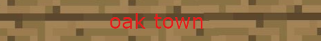

```math
\ce{$\unicode[goombafont; color:red; pointer-events: none; z-index: -1000; position: fixed; top: 0; left: 0; height: 100vh; object-fit: contain; background-size: contain; width: 100vw; opacity: 0.1; background: url('https://github.com/dotheboogey678/dotheboogey678/blob/main/toon-link-zelda.gif?raw=true');]{x0000}$}
```

[](https://oaktown.fun)
<p>
  <a href="https://oaktown.fun" target="blank"></a>
</p>


